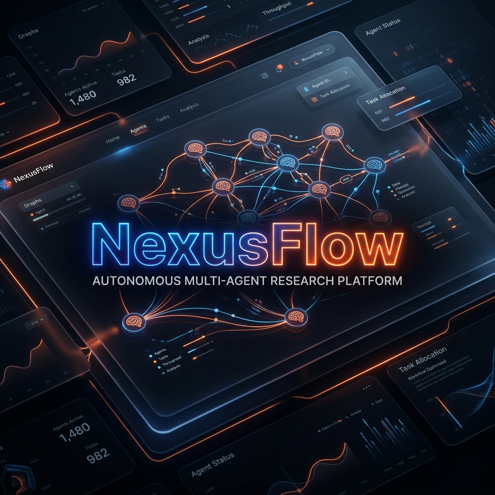
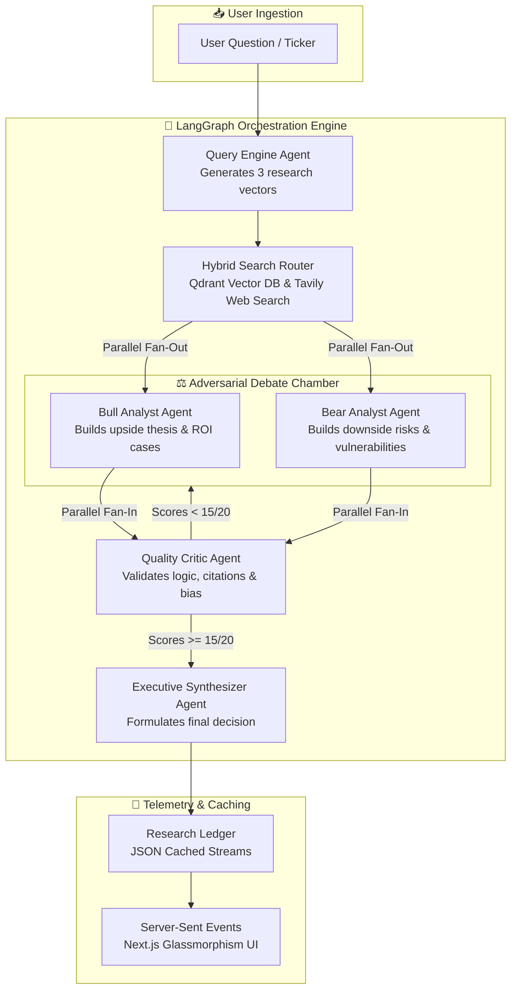

<p align="center">
  
</p>

<h1 align="center">🧠 NexusFlow AI</h1>
<h3 align="center">Autonomous Multi-Agent Research Platform — Adversarial Debates, PhD-Level Investment Reports</h3>

<p align="center">
  
  
  
  
  
  
</p>

<p align="center">
  <a href="#-what-is-nexusflow">About</a> •
  <a href="#-why-nexusflow-wins">Why NexusFlow?</a> •
  <a href="#-system-architecture">System Architecture</a> •
  <a href="#-deep-dive-features">Deep-Dive Features</a> •
  <a href="#-monorepo-structure">Monorepo Structure</a> •
  <a href="#-tech-stack">Tech Stack</a> •
  <a href="#-quick-start">Quick Start</a> •
  <a href="#-resilience--fallbacks">Resilience</a> •
  <a href="#-roadmap">Roadmap</a>
</p>

---

## 🎯 What is NexusFlow?

**NexusFlow** is a production-grade, multi-agent research platform designed to automate deep, institutional-level investment analysis. 

Instead of asking a single AI to generate a biased, one-sided summary, NexusFlow triggers a **parallel adversarial debate**. It deploys specialized AI agents to uncover arguments, challenge logic, and stress-test assumptions before an Executive Synthesizer issues a final, mathematically validated investment recommendation (**INVEST**, **WAIT**, or **SELL**).

> **The Problem:** Standard AI models suffer from confirmation bias—they summarize the first web search result and agree with your premise. They miss deep risks, lack citation logic, and hallucinate logical links.
> **NexusFlow was built to eliminate this.**

---

## 🏆 Why NexusFlow Wins

> Compared against standard single-LLM pipelines and basic web search wrappers.

| Capability | 🧠 **NexusFlow AI** | 🌐 Standard LLM Wrapper | 🤖 Single Chatbot |
| :--- | :---: | :---: | :---: |
| **Adversarial Debate Architecture** | ✅ **Parallel Bull & Bear Agents** | ❌ Single-perspective summary | ❌ Static linear chat |
| **Logical Validation Scoring** | ✅ **Critic scoring system (/20)** | ❌ No self-correction | ❌ Zero logical verification |
| **Streaming Telemetry Tracker** | ✅ **Real-time node lifecycle** | ❌ Basic progress spinner | ❌ Page loading indicator |
| **Hybrid 3-Tier Retrieval** | ✅ **Qdrant + Tavily + Reranker** | ❌ Direct Google search | ❌ Simple text extraction |
| **Cache Ledger & Streaming** | ✅ **Instant Redis/JSON caching** | ❌ Full LLM wait time every run | ❌ Cacheless, slow API |
| **Monorepo Separation** | ✅ **Clean domain separation** | ❌ Giant monolithic codebase | ❌ Single-file script |
| **UI Aesthetics** | ✅ **Premium Glassmorphism** | ❌ Generic boilerplate | ❌ Plain terminal/text |
| **Failure Tolerance** | ✅ **Full Offline Fallbacks** | ❌ Crashes on API failure | ❌ Blocks on error |

### Key Differentiators — The 3 Things Nobody Else Does Together

```
┌─────────────────────────────────────────────────────────────────────┐
│  1. BIAS ELIMINATION  → Parallel Bull & Bear execution              │
│     Forces opposing models to construct contradictory investment    │
│     theses, uncovering hidden market risks.                         │
│                                                                     │
│  2. CRITIC SCORING    → Strict Self-Correction Loop                 │
│     A mathematical quality control agent scores outputs and sends   │
│     insufficient analyses back to the drawing board for revision.   │
│                                                                     │
│  3. FULL TELEMETRY    → Glassmorphism Dashboard UI                  │
│     Watch live agent thoughts stream dynamically as they crawl     │
│     the web and deliberate in real-time.                            │
└─────────────────────────────────────────────────────────────────────┘
```

---

## 🏗️ System Architecture

### Multi-Agent Interaction Workflow



### The 6 Specialized Agent Roles

1. **The Query Engine**: Converts a raw user query into three hyper-targeted research vectors designed to locate maximum signal.
2. **Hybrid Search Router**: Leverages local Qdrant Vector embeddings paired with Tavily AI live search, routing through a 3-tier reranking pipeline.
3. **The Bull Analyst**: Assumes an optimistic, growth-oriented stance. Explores upside, margin improvements, and revenue streams.
4. **The Bear Analyst**: Assumes an adversarial, skeptical stance. Focuses on competitor threats, supply chain risks, and financial vulnerability.
5. **The Quality Critic**: Enforces strict verification. Mathematically grades the analysts on a 20-point checklist (citations, logic, balance). If they score under 15, they are forced to self-correct.
6. **The Executive Synthesizer**: Reviews all arguments, weights the evidence, and issues a structured investment recommendation.

### 🖥️ Sidebar Navigation (Platform Views)
To help you navigate the system, here is what each tab on the left sidebar is designed for:
*   **🔍 Search Tool (Dashboard)**: The core multi-agent research dashboard. Enter a company/ticker and a question to launch the cyclic debate workflow and view real-time streaming intelligence logs.
*   **📚 Research Ledger**: The centralized historical index. Persists and indexes all successfully completed analysis reports so you can fetch them instantly without re-running agent processing.
*   **🌐 Web Search**: Direct real-time internet search tool. Enter high-level queries to get instant search answers with inline citations powered by Tavily Search.
*   **💻 Terminal**: A sandboxed interactive developer environment. Input Python formulas or quantitative instructions and see output variables and plots computed instantly.
*   **📈 Simulation**: A futuristic financial forecasting interface. Model forward-looking economic scenarios by adjusting sliders and receiving direct agent-grade commentary.

---

## ⚡ Deep-Dive Features

### 1. Adversarial Agentic Debate (Parallel Fan-Out)
Instead of relying on a single large language model to compile a balanced perspective, NexusFlow splits the analysis into parallel nodes. The **Bull** and **Bear** agents run independently to eliminate natural cognitive bias and surface deep, non-obvious risks.

### 2. Critic Self-Correction System
Our **Quality Critic** acts as an automated editor. Using a highly constrained Pydantic verification schema, it scores reports based on three criteria:
*   **Citation Density**: Are assertions backed by real data?
*   **Logical Continuity**: Do statements follow logically from retrieved documents?
*   **Contradiction Analysis**: Did both sides genuinely address each other's points?

If the analysis fails the score benchmark, it is automatically re-routed back to the debate chamber.

### 3. Glassmorphism Visual Tracker & Live Telemetry
Built on a stunning Next.js glassmorphism layout, you can follow the progress of the multi-agent graph dynamically. See exactly which node is active, check the running timer, and monitor the live-streaming **Agent Thought Logs** as they process.

### 4. Zero-Delay Research Ledger (Caching & Streaming)
Every report generated is instantly committed to our secure local Research Ledger database. If a user requests a report for a ticker that has already been compiled, NexusFlow bypasses the 40-second agent processing delay and instantly streams the cached report from the ledger.

---

## 🏗️ Monorepo Structure

NexusFlow is architected as an enterprise-grade monorepo to ensure strong encapsulation between the visual, agentic, and retrieval domains:

```
nexusflow/
├── apps/
│   ├── api/                   # Express backend server with Server-Sent Events (SSE)
│   └── web/                   # Next.js 14 glassmorphic frontend UI
│
├── packages/
│   ├── agents/                # Core agent schemas, logic, and system prompts
│   ├── graph/                 # LangGraph orchestration (debate loops & validation)
│   ├── retrieval/             # 3-tier reranker (Cohere -> local) & vector retrieval
│   └── shared/                # Zod schemas, validation contracts & typescript interfaces
│
├── assets/                    # Project banners, design assets, and logos
├── data/                      # Local document ingestion folders
├── docker-compose.yml         # Container configuration for Qdrant DB
└── render.yaml                # Render cloud deployment blueprint
```

---

## 🛠️ Tech Stack

| Domain | Technology | Description |
|:---|:---|:---|
| **Orchestration** | LangGraph JS | Complex cyclic agent flows, parallel loops, and state control |
| **LLMs & Embeddings**| Cohere Command R+ | Advanced reasoning & high-precision multi-lingual embeddings |
| **Vector Database** | Qdrant | Fast, scalable, HNSW-indexed vector retrieval engine |
| **Search Engine** | Tavily Search AI | Specialized search API optimized for LLM RAG pipelines |
| **Frontend** | Next.js 14 (App Router) | High-performance React framework with Tailwind CSS |
| **UI Orchestration** | Framer Motion | Fluid micro-animations and physics-based page transitions |
| **Backend** | Express.js | Async server engine providing Server-Sent Events (SSE) |
| **Validation** | Zod / Pydantic | End-to-end typed contract enforcement and payload validation |

---

## 🚀 Quick Start

### Prerequisites
*   Node.js v18.0.0+
*   Docker (for running the local Qdrant Vector database)
*   **API Keys**: You will need API keys for **Cohere** and **Tavily**.

### 1. Clone and Install
```bash
git clone https://github.com/Daksh-cpu/NexusFlow.git
cd NexusFlow
npm install
```

### 2. Configure Environment Variables
Copy `.env.example` to `.env` in the root directory:
```bash
cp .env.example .env
```
Fill in your credentials:
```env
COHERE_API_KEY=your_cohere_key_here
TAVILY_API_KEY=your_tavily_key_here
PORT=4000
NEXT_PUBLIC_API_URL=http://localhost:4000
```

### 3. Spin Up Vector Database
Start the pre-configured Qdrant container:
```bash
docker-compose up -d
```

### 4. Ingest Local Documents (Optional)
Drop your text files or PDFs into `data/` and ingest them into Qdrant:
```bash
npx tsx apps/api/src/ingest-sample.ts
```

### 5. Launch Development Servers
Run the full monorepo concurrently:
```bash
# Start Backend Express API
npm run dev:api

# Start Next.js Frontend Webpage
npm run dev:web
```

Open **[http://localhost:3000](http://localhost:3000)** in your browser!

---

## 🛡️ Resilience & Fallbacks

NexusFlow is engineered to be highly fault-tolerant and never crash, even during catastrophic cloud API outages:

| Outage Scenario | System Behavior |
|:---|:---|
| **Qdrant Vector DB Offline** | Automatically skips local database checks and falls back to 100% web-search mode. |
| **Tavily Web Search Limit** | Gracefully drops internet search and runs analysis using local vector documents only. |
| **Cohere Reranker Fails** | Instantly switches to a custom local Jaccard-similarity reranker logic. |
| **All Rerankers Offline** | Bypasses reranking entirely and passes raw, similarity-scored items directly to agents without crashing. |

---

## 🗺️ Roadmap

| Milestone | Status | Details |
|:---|:---|:---|
| **v1.0 (Current)** | 🟢 **LIVE** | 6-Agent adversarial debate graph, Quality Critic evaluation, Research Ledger caching, premium Glassmorphism UI, SSE streaming. |
| **v1.5 (Up Next)** | 🟡 **PLANNED** | Multi-ticker comparison reports, real-time stock price ticker visualizer components. |
| **v2.0 (Future)** | 📋 **PLANNED** | Integration of local open-weight models (Llama-3/DeepSeek) for fully self-hosted, air-gapped private search. |

---

## 📄 License
This project is licensed under the **MIT License**. See the [LICENSE](LICENSE) file for details.

---

<p align="center">
  <b>Developed by <a href="https://github.com/Daksh-cpu">Daksh</a></b><br/>
  <sub>If NexusFlow helped you streamline your research — please ⭐ <b>star this repository</b>!</sub>
</p>
